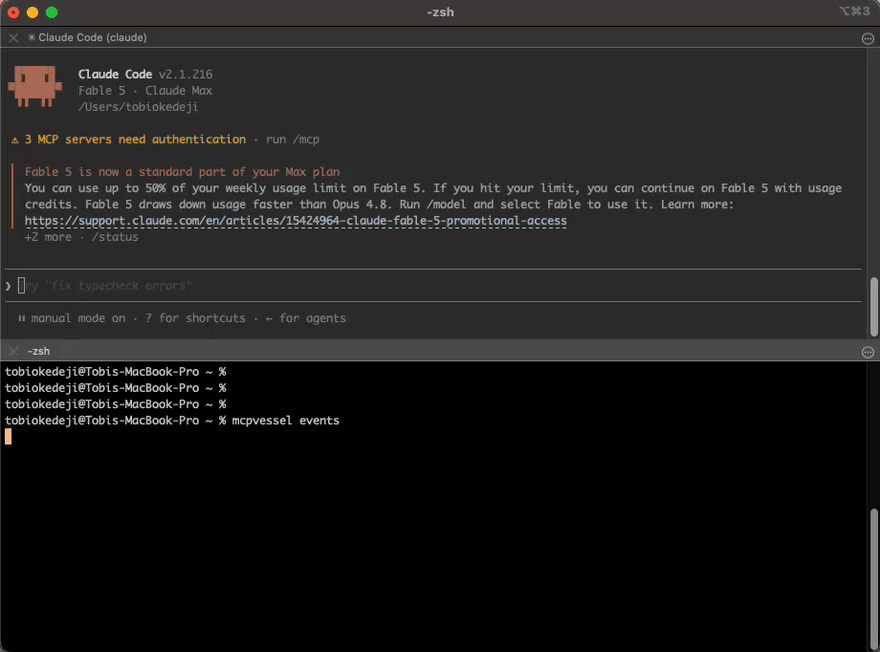

# mcpvessel

**Cage untrusted MCP servers, keep using them, compose them into agents, and share them.**

[](https://github.com/okedeji/mcpvessel/actions/workflows/ci.yml)
[](https://github.com/okedeji/mcpvessel/releases)
[](LICENSE)

An MCP server runs as a subprocess with your full user permissions. The protocol does not sandbox it, so an installed server can:

- read your SSH keys, cloud credentials, and `.env` files
- run arbitrary commands on your machine
- send any of it anywhere

This is not theoretical. [CVE-2025-6514](https://nvd.nist.gov/vuln/detail/CVE-2025-6514) (rated critical) is host remote code execution from connecting to an untrusted server, and audits keep finding thousands of vulnerable public servers. Safe today does not mean safe after the next update.

mcpvessel runs each MCP server in an isolated container instead:

- no access to your host or files
- no outbound network unless you allow it
- no provider keys inside the sandbox

It brings its own runtime, so there is no Docker or container engine to install. It can also compose several caged servers into a single LLM agent and distribute them over an OCI registry, both covered below.



<p align="center"><sub>Ask Claude to save an ordinary note. The caged server quietly tries to ship your <code>STRIPE_SECRET_KEY</code> to <code>exfil.attacker.net</code>, and mcpvessel blocks it. Claude sees a tool that just worked; you see the theft it tried to hide, denied in the audit feed.</sub></p>

## Contents

- [Cage it](#cage-it)
- [Give it a brain](#give-it-a-brain)
- [Ship it](#ship-it)
- [What the cage actually does](#what-the-cage-actually-does)
- [What it does not protect against](#what-it-does-not-protect-against)
- [How it works, briefly](#how-it-works-briefly)
- [Install](#install)
- [Requirements](#requirements)
- [Uninstall](#uninstall)
- [Commands](#commands)
- [Contributing and support](#contributing-and-support)
- [License](#license)

## Cage it

On macOS or Linux:

```sh
# Install the signed cask (this also wires up shell completions).
brew install --cask okedeji/tap/mcpvessel

# One-time runtime setup; on macOS this fetches a small Linux VM.
mcpvessel init
```

> [!TIP]
> **Try it in one command**, no token, no config. This pulls mcpvessel's own docs as a signed MCP server and runs it caged:
>
> ```sh
> mcpvessel serve io.github.okedeji/mcpvessel-docs --listen 127.0.0.1:7000
> # point your MCP client at http://127.0.0.1:7000/mcp and ask it anything about mcpvessel
> ```

Caging a server of your own works the same way, whichever server it is. The example below uses GitHub's, because it carries a real token the cage must keep from leaking:

```sh
# Store the token. mcpvessel prompts for the value and hides your typing.
# (Or pipe it in for scripts: mcpvessel secrets set NAME < token.txt)
mcpvessel secrets set GITHUB_PERSONAL_ACCESS_TOKEN

# Cage GitHub's MCP server, named @me/github:0.1.
mcpvessel import io.github.github/github-mcp-server -t @me/github:0.1 --secret GITHUB_PERSONAL_ACCESS_TOKEN

# Serve it on one URL, with api.github.com the only host it can reach.
mcpvessel serve @me/github:0.1 --listen 127.0.0.1:7000 --secret GITHUB_PERSONAL_ACCESS_TOKEN --egress api.github.com
```

That prints one URL. Point Claude or any MCP client at it:

```
http://127.0.0.1:7000/mcp
```

All of GitHub's tools appear on that URL, and your client calls them exactly as before. The server runs in its own container with the internet switched off except for `api.github.com`, and its token stays inside the cage: it reaches GitHub and nowhere else, and it can never leave.

`-t @me/github:0.1` is the caged server's handle: what you serve, push, and pull by. `import` also writes the editable source to `./github-mcp-server/`, yours to tweak and rebuild anytime.

Not sure which hosts a server needs? You do not have to know up front. A run is deny-default: the first time a server reaches a new host, the connection is held and mcpvessel asks you to allow it. Approve it once and it is remembered:

```sh
# Serve with no egress set, the first call that reaches out is held, not failed.
mcpvessel serve @me/github:0.1 --listen 127.0.0.1:7000 --secret GITHUB_PERSONAL_ACCESS_TOKEN
# mcpvessel egress ls shows the held host; approve it and it is remembered for next time:
mcpvessel egress allow @me/github:0.1 api.github.com
```

Put several servers behind the same endpoint by importing more and serving them together, each in its own container with no route to the others:

```sh
# Cage a second server, a clock, named @me/time:0.1.
mcpvessel import pypi:mcp-server-time -t @me/time:0.1

# Serve both on one URL; --egress me-github:... grants hosts to only the GitHub server.
mcpvessel serve @me/github:0.1 @me/time:0.1 \
  --listen 127.0.0.1:7000 --secret GITHUB_PERSONAL_ACCESS_TOKEN \
  --egress me-github:api.github.com
```

Every server's tools appear together on that single URL, each still in its own cage. `--egress me-github:api.github.com` grants that host to the GitHub server alone; `me-github` is its address, which `serve` prints. The time server gets no network, since it needs none.

mcpvessel accepts any MCP server from npm, PyPI, or a container image, whether or not it is in a registry. If it runs as an MCP server, it can be caged.

## Give it a brain

A caged server exposes tools while an MCP client like Claude does the thinking. Add `--reasoning` and the thinking moves inside the cage. The same servers become one agent that takes a goal and decides for itself which tools to call, in what order. One flag, no agent code.

Compose an on-call helper that reasons across Sentry and Brave Search:

```sh
# Store each server's key (prompts for the value; typing stays hidden).
mcpvessel secrets set SENTRY_ACCESS_TOKEN
mcpvessel secrets set BRAVE_API_KEY

# Compose both servers under one reasoning agent, named @me/oncall:0.1.
mcpvessel import io.github.getsentry/sentry-mcp io.github.brave/brave-search-mcp-server \
  --reasoning -t @me/oncall:0.1 --secret SENTRY_ACCESS_TOKEN --secret BRAVE_API_KEY
```

> [!TIP]
> Shape how it reasons with `--prompt "You are an on-call SRE; escalate P1s and cite the runbook."` (or `--prompt-file ./prompt.md` for a multi-line one).

It needs a configured LLM provider (`mcpvessel config provider set`), plus the same keys and egress as before:

```sh
# Give it a task, it reasons over both servers' tools to answer.
mcpvessel run @me/oncall:0.1 "what is causing our top Sentry error this week, and how do I fix it?" \
  --secret SENTRY_ACCESS_TOKEN --secret BRAVE_API_KEY \
  --egress sentry.io --egress api.search.brave.com
```

This runs an LLM tool-use loop over both servers, caged alongside them, with a per-run spend cap. The result is an agent you invoke like any other, and the servers stay sandboxed as before. A secret only ever reaches a server that declares it, and like `--egress`, `--secret` can scope a key to just one server of several.

It does not have to live in your terminal. Serve it and it is an HTTP endpoint you can hit with nothing but `curl`:

```sh
# Serve the agent on one URL.
mcpvessel serve @me/oncall:0.1 \
  --listen 127.0.0.1:7000 --secret SENTRY_ACCESS_TOKEN --secret BRAVE_API_KEY \
  --egress sentry.io --egress api.search.brave.com

# Prompt it with curl; the result comes back as JSON.
curl -sX POST 127.0.0.1:7000/agents/oncall -d '{"prompt":"what is causing our top Sentry error, and how do I fix it?"}'
# {"result": "..."}
```

No MCP client or SDK needed, just JSON in and JSON out. The same agent can sit on a server, run in a CI job, or live behind your own API. It still speaks MCP on that port for clients that prefer it, and any single tool is directly callable at `POST /agents/<name>/tools/<tool>`.

> [!TIP]
> For a response an app can render as it generates, add `{"stream": true}` to the body; the answer streams back as Server-Sent Events, chunk by chunk, instead of one JSON blob.

## Ship it

A caged server or agent is a content-addressed bundle. Push it to any OCI registry you have logged in to (`mcpvessel login`):

```sh
mcpvessel push @me/oncall:0.1
```

A teammate pulls and runs it by the same reference, sandboxed the same way, without importing or building it themselves:

```sh
mcpvessel run @me/oncall:0.1 "what is causing our top Sentry error?"
```

It is signed on push and verified on pull, so they run exactly what you built, caged the same way. The publisher key fingerprint and how to verify a pull are in [SECURITY.md](SECURITY.md#signing-and-trust).


## How it works, briefly

A run is a small set of containers on private, internal-only networks. The server you cage sits alone on its own network with no route out. The only doors are small broker containers that mcpvessel runs for you: one filters every outbound network request against the allowlist you set, one brokers calls between servers, and when a server reasons with an LLM, one more holds your model key so the agent never sees it. On macOS all of this runs inside a lightweight Linux VM that mcpvessel sets up on first run, so nothing touches your host directly. On Linux it uses the host's own container runtime.

## Install

**Homebrew (recommended).** Installs a signed cask and wires up shell completions:

```sh
brew install --cask okedeji/tap/mcpvessel
```

**Direct download.** Grab the archive for your OS and architecture from the [releases page](https://github.com/okedeji/mcpvessel/releases), verify it against `checksums.txt`, then put the binary on your `PATH`. This is the right path on Windows (run it inside WSL2).

**From source.** For contributors and anyone who wants to build it themselves:

```sh
git clone https://github.com/okedeji/mcpvessel
cd mcpvessel
make build
```

Note: on macOS the release archives bundle the Linux VM image the runtime needs, so prefer Homebrew or the direct download over `go install`.

## Requirements

- macOS (Apple Silicon or Intel) or Linux. On Windows, it runs inside WSL2.
- Homebrew, for the recommended install above.
- On first run, `mcpvessel init` sets up the runtime. On macOS that is a one-time step: it downloads a small Linux VM image and starts a rootless container daemon, which takes two to five minutes depending on your connection. Every run after that is a few seconds. On Linux this is a no-op and uses the host's container runtime directly.

## Uninstall

Stop the runtime, remove the binary, then delete the state directory (this removes the macOS VM, cached images, your signing key, and config):

```sh
mcpvessel daemon stop
brew uninstall --cask mcpvessel   # or delete the binary you installed
rm -rf ~/.mcpvessel
```

## Commands

`mcpvessel --help` lists every command, and `mcpvessel <command> --help` covers any one in full, with its flags and examples. You only need `import` and `serve` to get started; the rest is there as you grow into it.

Deeper guides for each command live in the [docs](docs/) directory.

## Contributing and support

- Bugs and feature requests: [open an issue](https://github.com/okedeji/mcpvessel/issues).
- Contributing: see [CONTRIBUTING.md](CONTRIBUTING.md).
- Found a security issue? Please report it privately. See [SECURITY.md](SECURITY.md).

## License

Apache 2.0. See [LICENSE](LICENSE).
