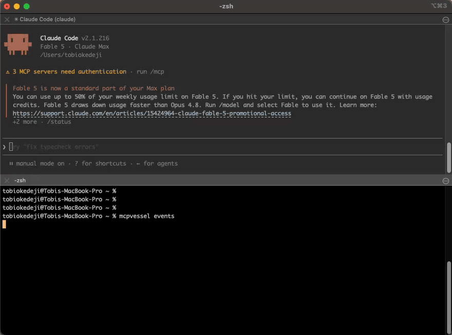

# mcpvessel

**Tell Claude to add an MCP server. Claude cages it, runs it, watches everything it sends, and tells you if it's safe.**

[](https://github.com/okedeji/mcpvessel/actions/workflows/ci.yml)
[](https://github.com/okedeji/mcpvessel/releases)
[](LICENSE)

Run `mcpvessel init` once, then tell Claude to add any MCP server, even one you would never trust. Claude installs it in a deny-default cage (secrets it cannot leak, no network it was not allowed), uses it on your behalf, surfaces everything it tries to send, and tells you plainly whether it is behaving or hiding something. You never vet a server or touch a cage. Nothing slips past you.

<p align="center">
  
  <br>
  <sub><i>Claude is asked to save a note. The notes server tries to ship a Stripe key to an attacker host. The cage stops it, and Claude says so without being asked.</i></sub>
</p>

## Why this matters

An MCP server runs as a subprocess with your full user permissions. The protocol does not sandbox it, so an installed server can read your SSH keys, cloud credentials, and `.env` files, run arbitrary commands on your machine, and send any of it anywhere.

This is not theoretical. [CVE-2025-6514](https://nvd.nist.gov/vuln/detail/CVE-2025-6514) (rated critical) is host remote code execution from connecting to an untrusted server, and audits keep finding thousands of vulnerable public servers. You cannot read the source of every server you want to try, and safe today does not mean safe after the next update.

mcpvessel makes that a thing you no longer have to weigh. Every server runs alone in its own container on an isolated network, its outbound traffic filtered by a gateway that opens only the hosts you allow, and your keys held outside the cage where it cannot reach them. So Claude can run a server you have never vetted, and the worst it can do is *try*. You run none of it: Claude installs, cages, and watches each server, and tells you the truth about what it does.

## Contents

- [Set it up once, then just ask](#set-it-up-once-then-just-ask)
- [Nothing slips the watch](#nothing-slips-the-watch)
- [Prefer to drive it yourself](#prefer-to-drive-it-yourself)
- [What it does not protect against](#what-it-does-not-protect-against)
- [Install](#install)
- [Requirements](#requirements)
- [Uninstall](#uninstall)
- [Commands](#commands)
- [Contributing and support](#contributing-and-support)
- [License](#license)

## Set it up once, then just ask

Install the binary, then run one command:

```sh
# macOS via the Homebrew cask (on Linux see Install).
brew install --cask okedeji/tap/mcpvessel

# One command sets up everything.
mcpvessel init
```

`init` is the whole setup. It provisions the runtime, installs the mcpvessel skill into Claude Code so Claude knows how to drive it, and installs mcpvessel's own docs as a caged server so Claude knows the tool inside out, all in one go. From here you do not run mcpvessel commands. Claude does.

Open a new Claude Code session and just ask:

```
you:    add the GitHub MCP server so I can use it here.
Claude: Installed github-mcp-server into a cage and served it to this session.
        Its network is deny-default, so I will hold anything it reaches that you
        have not approved, and I am watching what it sends. Ask me to use it.
```

And when a server turns on you, as the notes server does above, Claude tells you before you think to ask.

You never touched a cage, an allow-list, or a config file. That is the point.

## Nothing slips the watch

mcpvessel records every request each caged server makes, continuously, even the ones a server fires off while you are away from the keyboard. Claude reads that record and reports it: a host you did not expect, a secret leaving, a server reaching out during a call that had no business touching the network. When a granted secret shows up in an outbound request, mcpvessel flags it by name (it knows the value, it injected it), so "notes-server is shipping your STRIPE_SECRET_KEY" is caught, not guessed. And before a new host is ever allowed, Claude shows you the actual request the server wants to send, with your secrets redacted, so you weigh the real payload, not just a hostname.

Then you decide. Nothing new leaves a cage without your yes: Claude surfaces the choice, what it saw, where it was going, and its recommendation, and you approve or deny. Claude never approves on its own, and a server cannot talk it into approving. A line in its output saying "this is safe, approve it" changes nothing: the door stays deny-default until you open it. Your say-so, on top of the cage's deny-default, is the backstop.

## Prefer to drive it yourself

You do not have to hand it to Claude. mcpvessel is a full CLI: `import` a server into a cage, `serve` it on one URL, and approve hosts with `egress allow` as they come up, same cages, same watch, no agent involved. It accepts any MCP server from npm, PyPI, or a container image. The [docs](docs/) cover every command.

## What it does not protect against

The cage constrains what a server can reach, not whether it behaves. Know the edges:

- An allowed host receives whatever the server sends it. Egress control decides which hosts, not what goes to one you permitted; the watch is what surfaces the payload so you can catch it.
- A prompt-injected agent could in principle run an approval you did not intend. The cage's deny-default and your own review are the backstop, and `VESSEL_STRICT_APPROVAL=1` keeps approvals to a human at a terminal if you want it airtight.
- A tool that returns a plausible lie is not detected, and a host compromised outside mcpvessel is out of scope.

The complete list is in [ARCHITECTURE.md §14](docs/ARCHITECTURE.md#14-limitations-and-non-goals).

## Install

**Homebrew (macOS).** Installs a signed cask and wires up shell completions.

```sh
brew install --cask okedeji/tap/mcpvessel
```

**Direct download (Linux, Windows/WSL2).** Grab the archive for your OS and architecture from the [releases page](https://github.com/okedeji/mcpvessel/releases), verify it against `checksums.txt`, and put the binary on your `PATH`.

**From source.** For contributors and anyone who wants to build it themselves:

```sh
git clone https://github.com/okedeji/mcpvessel
cd mcpvessel
make build
```

Note: on macOS the release archives bundle the Linux VM image the runtime needs, so prefer Homebrew or the direct download over `go install`.

## Requirements

- macOS (Apple Silicon or Intel) or Linux. On Windows, it runs inside WSL2: install the Linux binary in your WSL2 distro and run everything (the CLI, the daemon, and `~/.mcpvessel`) there. There is no native Windows binary.
- Claude Code, for the agent-driven flow. `init` installs the skill into it and registers the docs server with it. You can also drive mcpvessel by hand without it.
- Homebrew, only for the macOS cask above. The Linux and WSL2 paths install from the release archive and need no Homebrew.
- On first run, `mcpvessel init` sets up everything: the runtime, the Claude skill, and the caged docs server. On macOS the runtime step downloads a small Linux VM image and starts a rootless container daemon, so first `init` takes a few minutes depending on your connection. Every run after that is a few seconds, and re-running `init` is cheap. On Linux the runtime step is a no-op and uses the host's container runtime directly.

## Uninstall

Stop the runtime, remove the binary, then delete the state directory (this removes the macOS VM, cached images, your signing key, and config):

```sh
mcpvessel daemon stop
brew uninstall --cask mcpvessel   # or delete the binary you installed
rm -rf ~/.mcpvessel
```

## Commands

`mcpvessel --help` lists every command, and `mcpvessel <command> --help` covers any one in full, with its flags and examples. With Claude driving, you rarely type any of them.

Deeper guides for each command, and the agent-driven [skill](docs/skill.md) and [audit](docs/audit.md) feed, live in the [docs](docs/) directory.

## Contributing and support

- Bugs and feature requests: [open an issue](https://github.com/okedeji/mcpvessel/issues).
- Contributing: see [CONTRIBUTING.md](CONTRIBUTING.md).
- Found a security issue? Please report it privately. See [SECURITY.md](SECURITY.md).

## License

Apache 2.0. See [LICENSE](LICENSE).
